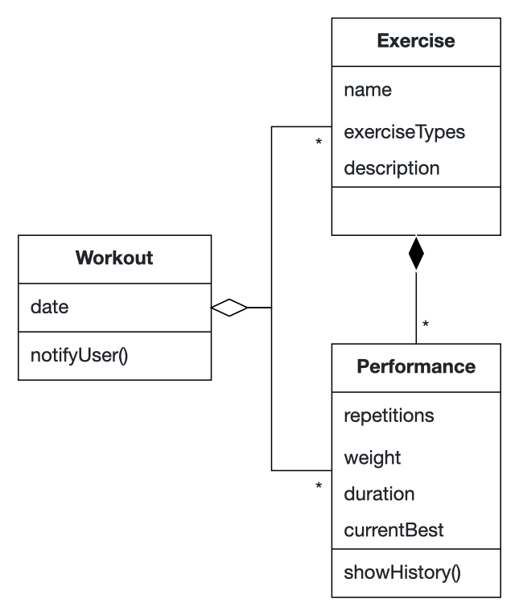
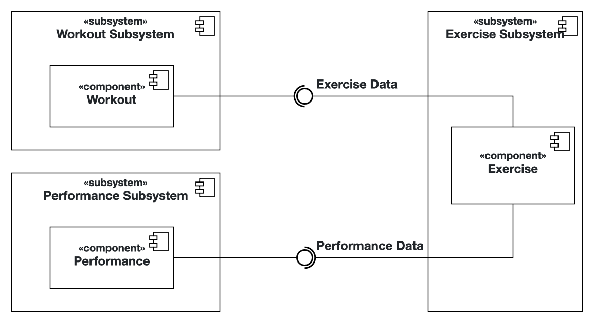

# Intro Course Project App of Fangxing Liu for the iPraktikum

To pass the intro course, you need to create your own unique iOS app (based on SwiftUI).

There are no requirements regarding the functions of your app, so you can get creative.
However, we provide you with Non-Functional Requirements (NFR) that your app needs to fulfill.

After each day of learning new Swift and SwiftUI concepts, these NFRs may change, or new NFRs get added.

## Submission procedure

You get a **personal repository** on Gitlab to work on your app.

Once you implemented a new feature into your app, you need to create a Merge Request (MR - Sometimes we will also reference these as "Pull Requests"(PR)) to merge your changes from the feature branch into your main branch.

Your tutor will review your changes and either request changes or approves the MR.

If your MR got approved, you also need to merge it!

### Deadline: **15.10.2024 23:59**

Until the deadline all of your PRs **need to be merged** and your final app **needs to fulfill** all of the requested NFRs!

---

## Problem Statement

As a student, it is really hard to keep up a healthy fitness routine, especially being consistent. Without reminders, I often stop doing my routine and lack the motivation to start again.

To overcome this challenge, I need an iOS application that can help me keep track of my workouts.

First of all, the app should allow me to add new workouts, specify the weekdays, and store a description of each workout.

Second of all, it would be nice to be able to add exercises and the corresponding performance metrics (repetitions, weight, etc.), and I would like to have an overview of past performances to see my personal progress.

Moreover, the app should provide me with notifications in the form of motivational texts to remind me of upcoming training sessions. This would help me maintain motivation and consistency in my fitness journey.

Additionally, I want to be able to generate motivational quotes to motivate me when opening the app.

In summary, as a student trying to maintain a healthy and balanced life, I need an iOS app that helps me keep track of my fitness routine, reminds me of workouts, and provides insights into my past progress. With such an app, I would be able to make better decisions in maintaining a better routine and ultimately achieve a healthier life.

## Requirements

As a student, I need an application to track my workouts and exercises.

I want to be able to ...
- ...add new workouts
- ...edit workouts
- ...receive notifications about upcoming workouts
- ...add new exercises
- ...input performance metrics for the exercises
- ...display exercise progress in a graph
- ...receive motivational quotes

## Analysis

## System Design

## Product Backlog

| name   |  task  | priority |
| ------ | ------ | ------|
|   5    | Edit performance | Medium |
|   6    | Delete performance | Medium |
|   10   | Delete workout | Medium |

